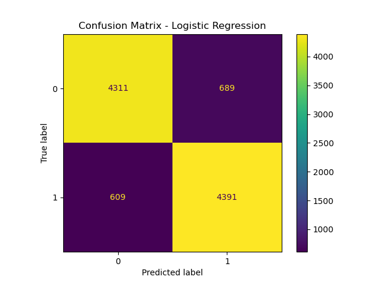
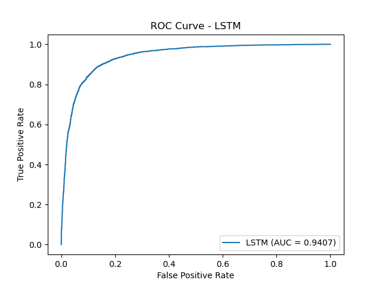
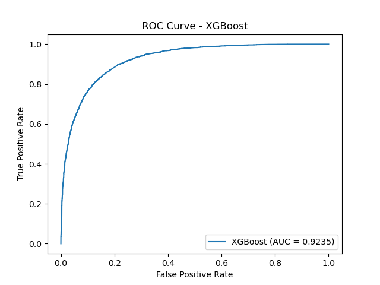

# Amazon Customer Sentiment Analysis

This project utilizes Natural Language Processing (NLP) to perform sentiment analysis on customer reviews of Amazon products. By applying various machine learning models,
including Logistic Regression, Random Forest, XGBoost, and LSTM, the goal is to classify customer reviews as either positive or negative.

## Project Overview:
1. **Goal**-	: To accurately classify customer reviews as positive or negative using machine learning techniques on text data.
2. **Dataset**	: The dataset consists of Amazon customer reviews, where reviews are labeled as either positive or negative. It is sourced from a text file containing millions of reviews.

	-**Rows**: Millions of customer reviews (sampled for this project).
	- **Columns**: Each review consists of two columns:
		1.Label: __label__1 for negative and __label__2 for positive reviews.
		2.Text: The actual customer review content.
	- **Target Variable**: Sentiment (positive or negative).

## Techniques Used:
1. **Data Preprocessing**:
	Cleaned text (removing special characters, numbers, and stopwords).
	Tokenized and vectorized using TF-IDF to transform text into numerical data.

2. **Exploratory Data Analysis (EDA)**:
	Visualized distribution of sentiment labels, most frequent words, and the relationship between word frequency and sentiment.

3. **Model Evaluation**:
  	--Built and evaluated multiple models: Logistic Regression, Random Forest, XGBoost, and LSTM.
	--Applied cross-validation and hyperparameter tuning to improve model performance.
	--Models were evaluated using accuracy, precision, recall, F1-score, and ROC-AUC metrics.
	

## Project Steps:
Data Preprocessing:
		1.Removed missing values from the dataset.
		2.Cleaned text data by removing special characters, converting text to lowercase, and tokenizing.
		3.Vectorized the text using TF-IDF for machine learning models.

## Exploratory Data Analysis (EDA):
1.Analyzed key features such as word frequency and sentiment distribution.
2.Created visualizations showing customer review sentiment trends.

## Modeling:
Trained classification models, including:
		1.Logistic Regression
		2.Random Forest
		3.XGBoost
		4.LSTM
		5.Applied cross-validation and hyperparameter tuning to optimize model performance.

## Model Evaluation:
Evaluated models using metrics such as accuracy, precision, recall, F1-score, and ROC-AUC.
Results:
	Best Model: The LSTM model performed the best with:
	Accuracy: 88%
	ROC-AUC: 0.94
	Feature Importance:
	Important features for sentiment classification:
	Review Text (keyword frequency)
	Review Length

## Improvements:
1.Data Augmentation: Implemented SMOTE to handle class imbalance in the dataset.
2.Hyperparameter Tuning: Used RandomizedSearchCV to fine-tune hyperparameters for Random Forest, Logistic Regression, and XGBoost.
3.Deep Learning: Integrated LSTM for sequence modeling, which improved accuracy and the ROC-AUC score.

## Visualizations:

### Confusion Matrix:
Here is the confusion matrix for Logistic Regression:

### ROC-AUC Curves:
Below are the ROC-AUC curves for various models:

- **Logistic Regression**:

- **LSTM**:

- **Random Forest**:

- **XGBoost**:

These visualizations help demonstrate the performance of the models and show their ability to distinguish between positive and negative sentiments.

These visualizations provide insights into model performance and feature importance.

- **Model Performance Comparison**:

| Model               | Accuracy | Precision | Recall | ROC-AUC |
|---------------------|----------|-----------|--------|---------|
| Logistic Regression  | 87.02%   | 88%       | 87%    | 0.9432  |
| Random Forest        | 84.15%   | 85%       | 84%    | 0.9196  |
| XGBoost              | 84.35%   | 86%       | 85%    | 0.9235  |
| LSTM                 | 88.00%   | 89%       | 88%    | 0.9407  |

## How to Run:
### Clone the repository:

	git clone https://github.com/himanshu-dandle/Amazon_customer_sentiment_analysis.git

### Install dependencies:

	conda env create -f environment.yml
	conda activate sentiment-env
### Download dataset:

You can download the dataset from [Kaggle](https://www.kaggle.com/datasets/blastchar/telco-customer-churn).
Place the train.ft.txt and test.ft.txt files in the data/ folder.

### Run the Jupyter notebook:

	jupyter notebook notebooks/sentiment_analysis.ipynb
